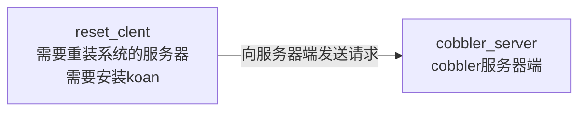

[TOC]

# COBBLER安装文档

### 一、cobbler介绍

-   cobbler 是基于 python 语言开发的 pxe 二次封装的网络安装服务；可以多系统选自自动化安装配置。可以通过 Web 图形化界面配置，其安装包为 cobbler，在 epel 源上，配置过程中某些过程可能需要依赖互联网环境。

#### 1、cobbler的作用

-   使用 Cobbler，无需进行人工干预即可安装机器。Cobbler 设置一个 PXE 引导环境（它还可以使用 yaboot 支持 PowerPC），并控制原装相关的所有方面，比如网络引导服务（DHCP 和 TFTP）与存储库镜像。当希望安装一台新机器时，Cobbler 可以：

1.   使用一个以前定义的模板来配置 DHCP 服务（如果启用了管理 DHCP）
2.   将一个存储库（yum 或 rsync）建立镜像或解压缩一个媒介，以注册一个新操作系统
3.   在 DHCP 配置文件中为需要安装的机器创建一个条目，并使用指定的参数（IP 和 MAC）
4.   在 TFTP 服务目录下创建适当的 PXE 文件
5.   重新启动 DHCP 服务来反应新的更改
6.   重新启动机器以开始安装（如果电源管理已启动


#### 2、cobbler支持的系统和功能

1.   Cobbler 支持众多的发行版：Redhat、Fedora、CentOS、Debian、Ubuntu 和 SUSE。当添加一个操作系统（通常通过使用 ISO 文件）时，Cobbler 知道如何解压缩合适的文件并调整网络服务，以正确引导机器。
2.   Cobbler 可以使用 kickstart 模板。基于 Redhat 或 Fedora 的系统使用 kickstart 文件来自动化安装流程，通过使用模板，就会拥有基本 kickstart 模板，然后定义如何针对一种配置文件或机器配置而替换其中的变量。例如，一个模板可能包含两个变量 $domain 和 $machine_name。在 Cobbler 配置中，一个配置文件指定 domain=mydomain.com，并且每台使用该配置文件的机器在 machine_name 变量中指定其名称。该配置文件的所有机器都是用相同的 kickstart 安装且针对 domain=mydomain.com 进行配置，但每台机器拥有其自己的机器名称。仍然可以使用 kickstart 模板在不同的域中安装其他机器并使用不同的机器名称。
3.   为了协助管理系统，Cobbler 可通过 **fence_scripts** 连接到各个电源管理环境。Cobbler 支持 apc_snmp、bladecenter、bullpap、drac、ether_wake、**ilo**、integrity、ipmilan、ipmitool、Ipar、rsa、virsh 和 wti。要重新安装一台机器，可运行 reboot system foo 命令，而且 Cobbler 会使用必要的信息来为您运行恰当的 **fence scripts**（比如机器插槽数）。
4.   除了这些特性，还可以使用一个配置管理系统（CMS）。有两种选择：该工具内的一个内部系统，或者现成的外部 CMS，比如 Chef 或 Puppet。借助内部系统，你可以指定文件模板，这些模板会依据配置参数进行处理（与 kickstart 模板的处理方式一样），然后复制到你指定的位置。如果必须自动将配置文件部署到特定机器，那么此功能很有用。
5.   使用 koan 客户端，Cobbler 可从客户端配置虚拟机并重新安装系统。

#### 3、cobbler提供的集成服务

1.   PXE 服务支持
2.   DHCP 服务管理
3.   DNS 服务管理（可选bind，dnsmasq）
4.   电源管理
5.   Kickstart 服务支持
6.   yum 仓库管理
7.   TFTP （PXE 启动时需要）
8.   Apache（提供 kickstart 的安装源，并提供定制化的 kickstart 配置）；同时，它和 apache 做了深度整合。

#### 4、PXE工作流程图

-   因为 cobbler 基于 pxe 二次封装的，所以了解 PXE 工作流程也重要，图如下：


#### 5、PXE + Kickstart 无人值守安装操作系统完整过程


#### 6、cobbler的工作流程


#### 7、cobbler相关工作路径介绍

```bash
查看 cobbler安装信息
# rpm -ql cobbler  # 查看安装的文件，下面列出部分。
/etc/cobbler                  # 配置文件目录
/etc/cobbler/settings         # cobbler主配置文件，这个文件是YAML格式，Cobbler是python写的程序。
/etc/cobbler/dhcp.template    # DHCP服务的配置模板
/etc/cobbler/tftpd.template   # tftp服务的配置模板
/etc/cobbler/rsync.template   # rsync服务的配置模板
/etc/cobbler/iso              # iso模板配置文件目录
/etc/cobbler/pxe              # pxe模板文件目录
/etc/cobbler/power            # 电源的配置文件目录
/etc/cobbler/users.conf       # Web服务授权配置文件
/etc/cobbler/users.digest     # 用于web访问的用户名密码配置文件
/etc/cobbler/dnsmasq.template # DNS服务的配置模板
/etc/cobbler/modules.conf     # Cobbler模块配置文件
/var/lib/cobbler              # Cobbler数据目录
/var/lib/cobbler/config       # 配置文件
/var/lib/cobbler/kickstarts   # 默认存放kickstart文件
/var/lib/cobbler/loaders      # 存放的各种引导程序
/var/www/cobbler              # 系统安装镜像目录
/var/www/cobbler/ks_mirror    # 导入的系统镜像列表
/var/www/cobbler/images       # 导入的系统镜像启动文件
/var/www/cobbler/repo_mirror  # yum源存储目录
/var/log/cobbler              # 日志目录
/var/log/cobbler/install.log  # 客户端系统安装日志
/var/log/cobbler/cobbler.log  # cobbler日志
```


### 二、cobbler的安装

#### 1、安装详情

1.   服务器使用的是centos7.9系统。
2.   已经配置好了yum源，
3.   配置好了时区、网卡
4.   已经关闭了防火墙和selinux
5.   cobbler和其他服务的版本使用的是yum 的版本
6.   **在虚拟机安装，必须要2G内存以上，不然会提示内存空间不足**

#### 1、必要服务

1.   cobbler （cobbler 的核心）
2.   xinetd （为 rsync 和 tftp 的守护进程）
3.   dhcpd （为自动安装系统分配 IP 地址）
4.   tftp （传送安装的一些文件的 类似ftp）
5.   rsync （cobbler 需要同步信息）
6.   cobbler-web （cobbler 的一个 web 插件）|选装-如果不用web可不装
7.   httpd （提供 cobbler 的 web 界面）|选装-如果不用web可不装

-   cobbler 和 apache 有深度配合所以安装 apache，不要安装 nginx 否则生成不了相关配置

#### 2、安装前配置

##### 1、关闭防火墙SElinux

#systemctl disable firewalld          # 关闭防火墙
#vim /etc/selinux/config               # 修改文件永久关闭selinux
SELINUX=disabled                         # 设置SELINUX的值为disabled

##### 2、安装epel源

```shell
wget -O /etc/yum.repos.d/epel.repo http://mirrors.aliyun.com/repo/epel-7.repo
```

#### 3、cobbler和相关服务的安装

-   fence-agents可不安装，tftp通过xinetd管理
-   debmirror 如果有debian，这个包就需要安装，centos不需要安装这个包
-   ftp 是用来做安装后脚本，给系统做初始化配置的

```bash
yum -y install cobbler cobbler-web tftp dhcp httpd xinetd pykickstart fence-agents rsyncd vsftpd # debmirror
```

#### 4、修改cobbler相关配置

##### 1）、确定使用dhcp配置的网卡

```bash
netcard='ens33'
IP=$(ifconfig ${netcard} |awk '/broadcast/{print $2}')
```

##### 2）、生成新装服务器的root密码(123456 为密码)

```bash
saltpwd=$(openssl passwd -1 -salt 'random-phrase-here' '123456')
```

- 这里在使用密码作为变量的时候不要用引号引起来，不然会导致密码变量失败，而导致密码输入错误

```bash
pwd='mghxy!23'
saltpwd=$(openssl passwd -1 -salt 'random-phrase-here' ${pwd})
```

##### 3）、修改tftp配置，使用xinetd管理tftp

```bash
sed -i 's@\(.*disable.*\)= yes@\1= no@' /etc/xinetd.d/tftp 
# sed -i '14s/yes/no/' /etc/xinetd.d/tftp
```

##### 4）、修改debian系统相关配置（centos不用改）

```bash
sed -ie "s/@arches=\"i386\"/#@arches=\"i386\"/;\
        s/@dists=\"sid\"/#@dists=\"sid\"/" /etc/debmirror.conf
```

##### 5）、修改dhcp相关配置

```bash
sed -ie "s/192.168.1/${IP%.*}/g;\
        s/${IP%.*}.5/${IP}/;\
        s/${IP%.*}.100/${IP%.*}.200/;\
        s/\$next_server/${IP}/" /etc/cobbler/dhcp.template
```

##### 6）、修改cobbler相关配置

1.   server		---		Cobbler服务器的IP
2.   next_server  ---  指定下一条服务地址
3.   manage_dhcp ----  用Cobbler管理DHCP
4.   pxe_just_once ---- 防止循环装系统，适用于服务器第一启动项是PXE启动---防止客户端重复安装操作系统

```bash

sed -ie "s/\(^server:\).*/\1 ${IP}/;\
        s/\(^next_server:\).*/\1 ${IP}/;\
        s@\(default_password_crypted:\).*@\1 \"${saltpwd}\"@;\
        s/manage_dhcp: 0/manage_dhcp: 1/;\
        s/pxe_just_once: 0/pxe_just_once: 1/;\
        " /etc/cobbler/settings 
```

#### 5、启动cobbler相关服务

```bash
systemctl enable --now cobblerd httpd xinetd rsyncd vsftpd
```


#### 6、检查cobbler配置

-   如果如下提示就没什么问题了，如果还有其他的问题，就到网上去查看下相关的错误就行

```bash
cobbler check
```

```bash
$ cobbler check
The following are potential configuration items that you may want to fix:

1 : Some network boot-loaders are missing from /var/lib/cobbler/loaders.  If you only want to handle x86/x86_64 netbooting, you may ensure that you have installed a *recent* version of the syslinux package installed and can ignore this message entirely.  Files in this directory, should you want to support all architectures, should include pxelinux.0, menu.c32, elilo.efi, and yaboot.

Restart cobblerd and then run 'cobbler sync' to apply changes.
```

#### 7、同步cobbler配置到其他服务

```bash
cobbler sync

# --------TFPT和DHCP都在了cobbler中--------------
generating /etc/dhcp/dhcpd.conf
generating /etc/xinetd.d/tftp
```

```bash
$ cobbler sync
task started: 2022-03-21_164341_sync
task started (id=Sync, time=Mon Mar 21 16:43:41 2022)
running pre-sync triggers
cleaning trees
removing: /var/lib/tftpboot/grub/images
copying bootloaders
trying hardlink /usr/share/syslinux/pxelinux.0 -> /var/lib/tftpboot/pxelinux.0
trying hardlink /usr/share/syslinux/menu.c32 -> /var/lib/tftpboot/menu.c32
trying hardlink /usr/share/syslinux/memdisk -> /var/lib/tftpboot/memdisk
copying distros to tftpboot
copying images
generating PXE configuration files
generating PXE menu structure
rendering DHCP files
generating /etc/dhcp/dhcpd.conf
rendering TFTPD files
generating /etc/xinetd.d/tftp
cleaning link caches
running post-sync triggers
running python triggers from /var/lib/cobbler/triggers/sync/post/*
running python trigger cobbler.modules.sync_post_restart_services
running: dhcpd -t -q
received on stdout: 
received on stderr: 
running: service dhcpd restart
received on stdout: 
received on stderr: Redirecting to /bin/systemctl restart dhcpd.service

running shell triggers from /var/lib/cobbler/triggers/sync/post/*
running python triggers from /var/lib/cobbler/triggers/change/*
running python trigger cobbler.modules.manage_genders
running python trigger cobbler.modules.scm_track
running shell triggers from /var/lib/cobbler/triggers/change/*
*** TASK COMPLETE ***
```


#### 8、挂载镜像

-   把镜像放入系统

```
mkdir /media/cdrom
mount /dev/cdrom /media/cdrom
```

#### 9、导入centos镜像到cobbler

```
cobbler import --path=/media/cdrom --name=centos7 --arch=x86_64
```

-   --path 镜像路径

-   --name 为安装源定义一个名字

-   --arch 指定安装源是32位、64位、ia64, 目前支持的选项有: x86│x86_64│ia64

-   安装源的唯一标示就是根据name参数来定义，本例导入成功后，安装源的唯一标示就是： CentOS-7-x86_64

-   如果重复，系统会提示导入失败。

```bash
$ cobbler import --path=/media/cdrom --name=centos7 --arch=x86_64
task started: 2022-03-21_164514_import
task started (id=Media import, time=Mon Mar 21 16:45:14 2022)
Found a candidate signature: breed=suse, version=opensuse15.0
Found a candidate signature: breed=suse, version=opensuse15.1
Found a candidate signature: breed=redhat, version=rhel6
Found a candidate signature: breed=redhat, version=rhel7
Found a matching signature: breed=redhat, version=rhel7
Adding distros from path /var/www/cobbler/ks_mirror/centos7-x86_64:
creating new distro: centos7-x86_64
trying symlink: /var/www/cobbler/ks_mirror/centos7-x86_64 -> /var/www/cobbler/links/centos7-x86_64
creating new profile: centos7-x86_64
associating repos
checking for rsync repo(s)
checking for rhn repo(s)
checking for yum repo(s)
starting descent into /var/www/cobbler/ks_mirror/centos7-x86_64 for centos7-x86_64
processing repo at : /var/www/cobbler/ks_mirror/centos7-x86_64
need to process repo/comps: /var/www/cobbler/ks_mirror/centos7-x86_64
looking for /var/www/cobbler/ks_mirror/centos7-x86_64/repodata/*comps*.xml
Keeping repodata as-is :/var/www/cobbler/ks_mirror/centos7-x86_64/repodata
*** TASK COMPLETE ***
```

#### 10、镜像查看

##### 1）、查看镜像信息

```
cobbler distro report --name=centos7-x86_64
```

```bash
$ cobbler distro report --name=centos7-x86_64
Name                           : centos7-x86_64
Architecture                   : x86_64
TFTP Boot Files                : {}
Breed                          : redhat
Comment                        : 
Fetchable Files                : {}
Initrd                         : /var/www/cobbler/ks_mirror/centos7-x86_64/images/pxeboot/initrd.img
Kernel                         : /var/www/cobbler/ks_mirror/centos7-x86_64/images/pxeboot/vmlinuz
Kernel Options                 : {}
Kernel Options (Post Install)  : {}
Kickstart Metadata             : {'tree': 'http://@@http_server@@/cblr/links/centos7-x86_64'}
Management Classes             : []
OS Version                     : rhel7
Owners                         : ['admin']
Red Hat Management Key         : <<inherit>>
Red Hat Management Server      : <<inherit>>
Template Files                 : {}
```

##### 2）、查看镜像安装信息

```bash
cobbler profile report --name=centos7-x86_64
```

```bash
$ cobbler profile report --name=centos7-x86_64
Name                           : centos7-x86_64
TFTP Boot Files                : {}
Comment                        : 
DHCP Tag                       : default
Distribution                   : centos7-x86_64
Enable gPXE?                   : 0
Enable PXE Menu?               : 1
Fetchable Files                : {}
Kernel Options                 : {}
Kernel Options (Post Install)  : {}
Kickstart                      : /var/lib/cobbler/kickstarts/sample_end.ks
Kickstart Metadata             : {}
Management Classes             : []
Management Parameters          : <<inherit>>
Name Servers                   : []
Name Servers Search Path       : []
Owners                         : ['admin']
Parent Profile                 : 
Internal proxy                 : 
Red Hat Management Key         : <<inherit>>
Red Hat Management Server      : <<inherit>>
Repos                          : []
Server Override                : <<inherit>>
Template Files                 : {}
Virt Auto Boot                 : 1
Virt Bridge                    : xenbr0
Virt CPUs                      : 1
Virt Disk Driver Type          : raw
Virt File Size(GB)             : 5
Virt Path                      : 
Virt RAM (MB)                  : 512
Virt Type                      : kvm
```

##### 3）、查看镜像列表

```bash
$ cobbler distro list
   centos7-x86_64
```

#### 11、指定镜像加载的ks文件

##### 1）、新增profile文件

- 镜像文件有一个就行了，后面多用profile来安装不同的系统就好

```
cobbler profile add --distro=centos7_min-x86_64 --name=centos7 --kickstart=/var/lib/cobbler/kickstarts/centos7.ks
```

##### 2）、编辑profile文件

```bash
cobbler profile edit --name=centos7-x86_64 --kickstart=/var/lib/cobbler/kickstarts/centos7.ks 
```

自己编写ks文件

-   这里的ks文件不支持中文，写入中文会卡在初始化安装界面，不要怀疑为什么你装机会卡在进度条里不动了，那是因为ks文件有问题，记得删除中文

    删除中文

```
sed  -i 's/#.*//g' /var/lib/cobbler/kickstarts/centos7.ks
```


```bash
cat >/var/lib/cobbler/kickstarts/centos7.ks<<'EOF'
# Cobbler for Kickstart Configurator for CentOS 7 by clsn
install             #安装系统
url --url=$tree     #url地址为cobbler内置变量
text                #文本方式安装，修改为图形界面则为Graphical
lang en_US.UTF-8    #语言
keyboard us  #键盘
zerombr   #该参数用于清除引导信息，需要让其生效可以在参数后添加yes即可。
bootloader --location=mbr --driveorder=sda --append="crashkernel=auto rhgb quiet"
#指定引导装载程序怎样被安装.对于安装和升级,这个选项都是必需的.
#Network information
$SNIPPET('network_config')  #该参数表示使用下方%pre中的脚本来配置网络，相关脚本存放于/var/lib/cobbler/snippets
#如果不需要脚本配置可启用以下配置
#network --bootproto=dhcp --device=eth0 --onboot=yes --noipv6 --hostname=CentOS7
timezone --utc Asia/Shanghai      #时区
authconfig --enableshadow --passalgo=sha512  #加密shadow
rootpw  --iscrypted $default_password_crypted  #设置root密码
clearpart --all --initlabel   #--all删除所有分区，后者将磁盘标签初始化为缺省值设置。
part /boot --fstype="xfs" --ondisk=sda --size=1024 #boot分区大小
part swap --fstype="swap" --ondisk=sda --size=1024 #swap分区大小
# part /home --fstype="xfs" --ondisk=sda --size=10899 #根分区大小
part / --fstype="xfs" --ondisk=sda --size=1 --grow

firstboot --disable      #决定是否在系统第一次引导时启动"设置代理”.禁用
selinux --disabled       #在系统里设置SELinux状态.
firewall --disabled      #在系统狸设置而防火墙状态
logging --level=info     #这个命令控制安装过程中anaconda的错误日志.它对安装好的系统没有影响。
reboot                   #安装后重启
%pre                     #pre中定了前面使用的具体脚本名称。
$SNIPPET('log_ks_pre')
$SNIPPET('kickstart_start')
$SNIPPET('pre_install_network_config')
# Enable installation monitoring
$SNIPPET('pre_anamon')
%end
%packages                #自定义安装内容，这里可以可以自行生成ks文件然后把对应的配置复制到这里。当前配置为最小化安装，以及安装系统常用工具。
$SNIPPET('func_install_if_enabled')
%end
%post                   #安装后执行操作，可以执行脚本也可以直接执行命令。
$SNIPPET('log_ks_post')
# Start yum configuration
$yum_config_stanza
# End yum configuration
$SNIPPET('post_install_kernel_options')
$SNIPPET('post_install_network_config')
$SNIPPET('func_register_if_enabled')
$SNIPPET('download_config_files')
$SNIPPET('koan_environment')
$SNIPPET('redhat_register')
$SNIPPET('cobbler_register')
# Enable post-install boot notification
$SNIPPET('post_anamon')
# Start final steps
$SNIPPET('kickstart_done')
# End final steps
# initsystem
curl -o /tmp/initsystem.sh ftp://10.0.0.186/pub/initsystem.sh
/bin/bash /tmp/initsystem.sh >> /tmp/initsystem.log
%end
EOF
sed  -i 's/#.*//g' /var/lib/cobbler/kickstarts/centos7.ks
```

-   安装后脚本
    -   把脚本放到`/var/ftp/pub/`下面

```bash
cat > /var/ftp/pub/initsystem.sh<<'EOFA'
#!/bin/sh
# data: 20220225
# auth: hxy


# 配置yum源
make_yum(){
sed -i.bak \
    -e 's|^mirrorlist=|#mirrorlist=|g' \
    -e 's|^#baseurl=http://mirror.centos.org|baseurl=https://mirrors.tuna.tsinghua.edu.cn|g' \
    /etc/yum.repos.d/CentOS-*.repo
    
    #update the system
    yum clean all && yum makecache faste

    sleep 1
    
    # 清华源有epel，可以直接安装
    yum install epel-release -y
    sed -i.bak \
    -e 's!^metalink=!#metalink=!g' \
    -e 's!^#baseurl=!baseurl=!g' \
    -e 's!//download\.fedoraproject\.org/pub!//mirrors.tuna.tsinghua.edu.cn!g' \
    -e 's!http://mirrors!https://mirrors!g' \
    /etc/yum.repos.d/epel.repo /etc/yum.repos.d/epel-testing.repo
        
    yum makecache faste
}

# 时间同步
make_ntp(){
yum install ntp -y
/usr/sbin/ntpdate cn.pool.ntp.org > /dev/null 2>&1
    
cat >> /var/spool/cron/root << EOF
*/5 * * * * /usr/sbin/ntpdate cn.pool.ntp.org > /dev/null 2>&1
* * * * */1 /usr/sbin/hwclock -w > /dev/null 2>&1
EOF

systemctl restart crond
}


set_limits(){
    if [ ! -f "/etc/security/limits.conf.bak" ]; then
        cp /etc/security/limits.conf /etc/security/limits.conf.bak
    fi

    sed -i "/^*.*soft.*nofile/d" /etc/security/limits.conf
    sed -i "/^*.*hard.*nofile/d" /etc/security/limits.conf
    sed -i "/^*.*soft.*nproc/d" /etc/security/limits.conf
    sed -i "/^*.*hard.*nproc/d" /etc/security/limits.conf
    
cat >> /etc/security/limits.conf << EOF
#---------custom-----------------------
*           soft   nofile       65535
*           hard   nofile       65535
*           soft   nproc        65535
*           hard   nproc        65535
EOF

if [ ! -f "/etc/sysctl.conf.bak" ]; then
    cp /etc/sysctl.conf /etc/sysctl.conf.bak
fi

cat > /etc/sysctl.conf << EOF
#-------custom---------------------------------------------
#
net.ipv4.ip_forward = 0
net.ipv4.conf.default.rp_filter = 1
net.ipv4.conf.default.accept_source_route = 0
kernel.sysrq = 0
kernel.core_uses_pid = 1
net.ipv4.tcp_syncookies = 1
kernel.msgmnb = 65536
kernel.msgmax = 65536
net.ipv4.tcp_max_tw_buckets = 6000
net.ipv4.tcp_sack = 1
net.ipv4.tcp_window_scaling = 1
net.ipv4.tcp_rmem = 4096    87380   4194304
net.ipv4.tcp_wmem = 4096    16384   4194304
net.core.wmem_default = 8388608
net.core.rmem_default = 8388608
net.core.rmem_max = 16777216
net.core.wmem_max = 16777216
net.core.netdev_max_backlog = 262144
net.core.somaxconn = 262144
net.ipv4.tcp_max_orphans = 3276800
net.ipv4.tcp_max_syn_backlog = 262144
net.ipv4.tcp_timestamps = 0
net.ipv4.tcp_synack_retries = 2
net.ipv4.tcp_syn_retries = 2
net.ipv4.tcp_tw_recycle = 1
net.ipv4.tcp_tw_reuse = 1
net.ipv4.tcp_mem = 94500000 915000000 927000000
net.ipv4.tcp_fin_timeout = 15
net.ipv4.tcp_keepalive_time = 30
net.ipv4.ip_local_port_range = 1024    65535
EOF
}

set_kernel(){
    #buckets
    echo 6000 > /proc/sys/net/ipv4/tcp_max_tw_buckets
     
    #delete
    sed -i "/^kernel.shmmax/d;/^kernel.shmall/d" /etc/sysctl.conf
    #add
    shmmax=`free -l |grep Mem |awk '{printf("%d\n",$2*1024*0.9)}'`
    shmall=$[$shmmax/4]
    echo "kernel.shmmax = "$shmmax >> /etc/sysctl.conf
    echo "kernel.shmall = "$shmall >> /etc/sysctl.conf
    #bridge
    modprobe bridge
    lsmod|grep bridge
    #reload sysctl
    /sbin/sysctl -p
}

set_servers(){
    #disable selinux #关闭SELINUX
    sed -i 's/SELINUX=enforcing/SELINUX=disabled/' /etc/selinux/config
    setenforce 0
    echo -e "\033[31m selinux ok \033[0m"

    # 修改SSH
    sed -i 's/^GSSAPIAuthentication yes$/GSSAPIAuthentication no/' /etc/ssh/sshd_config
    sed -i '/^#UseDNS/s/#UseDNS yes/UseDNS no/g' /etc/ssh/sshd_config
    sed -i 's/#UseDNS yes/UseDNS no/' /etc/ssh/sshd_config
    #关闭无密码登录
    sed -i 's/#PermitEmptyPasswords no/PermitEmptyPasswords no/g' /etc/ssh/sshd_config
    /etc/init.d/sshd restart


    #关闭一些没用的服务
    chkconfig bluetooth off > /dev/null 2>&1
    chkconfig cups off  > /dev/null 2>&1
    chkconfig ip6tables off  > /dev/null 2>&1
    chkconfig | grep -E "cups|ip6tables|bluetooth"

    systemctl disable firewalld
    systemctl stop firewalld
}


update_profile(){
cat >> /etc/profile << EOF
#设置core文件的最大值
ulimit -c unlimited
#设置堆栈的最大值
ulimit -s unlimited
#句柄数为102400
ulimit -SHn 102400
EOF
    # PS1
    sed -i "/^PS1=.*/d" /etc/profile
    echo 'export PS1="\[\033[01;36m\]\u\[\033[00m\]@\[\033[01;32m\]\h\[\033[00m\][\[\033[01;33m\]\t\[\033[00m\]]:\[\033[01;34m\]\w\[\033[00m\]\n$ "' >> /etc/bashrc
    source /etc/bashrc
        
    # Record command用户操作行为纪录
    sed -i "/^export PROMPT_COMMAND=.*/d" /root/.bash_profile
    echo "export PROMPT_COMMAND='{ msg=\$(history 1 | { read x y; echo \$y; });user=\$(whoami); echo \$(date \"+%Y-%m-%d %H:%M:%S\"):\$user:\`pwd\`/:\$msg ---- \$(who am i); } >> /tmp/\`hostname\`.\`whoami\`.history-timestamp'" >> /root/.bash_profile
         
    # Wrong password five times locked 180s
    sed -i "/^auth        required      pam_tally2.so deny=5 unlock_time=180/d" /etc/pam.d/system-auth
    sed -i '4a auth        required      pam_tally2.so deny=5 unlock_time=180' /etc/pam.d/system-auth
    source /etc/profile
}

#新增用户
add_user(){
    useradd aizbx
    echo 'aiLab@2021'| passwd --stdin aizbx
    sed -i '101aaizbx     ALL=(ALL)    NOPASSWD: ALL' /etc/sudoers
}

add_baseServer(){
    # 安装必要支持工具及软件工具
    serverList="vim git kexec-tools redhat-lsb net-tools bash-completion chrony dos2unix lrzsz sysstat tree git unzip gcc gcc-c++ koan"
    for server in $serverList
        do
            yum install $server -y
        done
}

add_nginx(){
    yum install nginx -y
    systemctl enable --now nginx
    cp /usr/share/nginx/html/index.html{,.bak}
    echo '<h1>hello ailabe</h1>' >/usr/share/nginx/html/index.html
}

main(){
    make_yum
    make_ntp
    set_limits
    set_kernel
    set_servers
    update_profile
    add_user
    add_baseServer
    add_nginx
}
main
EOFA
```


#### 12、重启cobbler再次同步

```bash
$ systemctl restart cobblerd
$ cobbler sync
task started: 2022-03-21_165705_sync
task started (id=Sync, time=Mon Mar 21 16:57:05 2022)
running pre-sync triggers
cleaning trees
removing: /var/www/cobbler/images/centos7-x86_64
removing: /var/lib/tftpboot/pxelinux.cfg/default
removing: /var/lib/tftpboot/grub/images
removing: /var/lib/tftpboot/grub/efidefault
removing: /var/lib/tftpboot/images/centos7-x86_64
removing: /var/lib/tftpboot/s390x/profile_list
copying bootloaders
copying distros to tftpboot
copying files for distro: centos7-x86_64
trying hardlink /var/www/cobbler/ks_mirror/centos7-x86_64/images/pxeboot/vmlinuz -> /var/lib/tftpboot/images/centos7-x86_64/vmlinuz
trying hardlink /var/www/cobbler/ks_mirror/centos7-x86_64/images/pxeboot/initrd.img -> /var/lib/tftpboot/images/centos7-x86_64/initrd.img
copying images
generating PXE configuration files
generating PXE menu structure
copying files for distro: centos7-x86_64
trying hardlink /var/www/cobbler/ks_mirror/centos7-x86_64/images/pxeboot/vmlinuz -> /var/www/cobbler/images/centos7-x86_64/vmlinuz
trying hardlink /var/www/cobbler/ks_mirror/centos7-x86_64/images/pxeboot/initrd.img -> /var/www/cobbler/images/centos7-x86_64/initrd.img
Writing template files for centos7-x86_64
rendering DHCP files
generating /etc/dhcp/dhcpd.conf
rendering TFTPD files
generating /etc/xinetd.d/tftp
processing boot_files for distro: centos7-x86_64
cleaning link caches
running post-sync triggers
running python triggers from /var/lib/cobbler/triggers/sync/post/*
running python trigger cobbler.modules.sync_post_restart_services
running: dhcpd -t -q
received on stdout: 
received on stderr: 
running: service dhcpd restart
received on stdout: 
received on stderr: Redirecting to /bin/systemctl restart dhcpd.service

running shell triggers from /var/lib/cobbler/triggers/sync/post/*
running python triggers from /var/lib/cobbler/triggers/change/*
running python trigger cobbler.modules.manage_genders
running python trigger cobbler.modules.scm_track
running shell triggers from /var/lib/cobbler/triggers/change/*
*** TASK COMPLETE ***
```

#### 13、查看cobbler新生成的配置文件

```bash
$ cobbler profile report --name=centos7-x86_64
Name                           : centos7-x86_64
TFTP Boot Files                : {}
Comment                        : 
DHCP Tag                       : default
Distribution                   : centos7-x86_64
Enable gPXE?                   : 0
Enable PXE Menu?               : 1
Fetchable Files                : {}
Kernel Options                 : {}
Kernel Options (Post Install)  : {}
Kickstart                      : /var/lib/cobbler/kickstarts/centos.ks
Kickstart Metadata             : {}
Management Classes             : []
Management Parameters          : <<inherit>>
Name Servers                   : []
Name Servers Search Path       : []
Owners                         : ['admin']
Parent Profile                 : 
Internal proxy                 : 
Red Hat Management Key         : <<inherit>>
Red Hat Management Server      : <<inherit>>
Repos                          : []
Server Override                : <<inherit>>
Template Files                 : {}
Virt Auto Boot                 : 1
Virt Bridge                    : xenbr0
Virt CPUs                      : 1
Virt Disk Driver Type          : raw
Virt File Size(GB)             : 5
Virt Path                      : 
Virt RAM (MB)                  : 512
Virt Type                      : kvm
```

可以看到kickstart配置文件已经重新指定了

`Kickstart                      : /var/lib/cobbler/kickstarts/centos.ks`

#### 14、登录cobbler_web

1.   访问`https://ip/cobbler_web` 
2.   默认账号是cobbler密码也是cobbler


3.   通过cobbler认证文件新建web用户
     -   **注意:**添加第一个用户时,使用**“-c”**选项，后续添加其他用户时不要再使用， cobbler_web的admin只能为Cobbler

```
htdigest -c /etc/cobbler/users.digest Cobbler admin
```

```bash
[root@centosBase 17:48:47 ~]$ 
$ cat /etc/cobbler/users.digest 
cobbler:Cobbler:a2d6bae81669d707b72c0bd9806e01f3
[root@centosBase 17:58:03 ~]$ 
$ htdigest -c /etc/cobbler/users.digest Cobbler admin
Adding password for admin in realm Cobbler.
New password: 
Re-type new password: 
[root@centosBase 17:58:18 ~]$ 
$ cat /etc/cobbler/users.digest
admin:Cobbler:ec0cff8a86a4bc93ada04ae276f62843
3
```


#### 15、测试安装

##### 1）、在虚拟机上新建一台同一网段的服务器，


##### 2）、测试成功

 


### 三、根据服务器mac安装指定系统

#### 1、修改网卡名为ethX

-   由于centos7网卡会随机变化，为了运维的方便，需要将网卡设置为ethX类型的
-   修改安装系统的内核参数，

```bash
cobbler profile edit --name=centos7-x86_64 --kopts='net.ifnames=0 biosdevname=0'

内核参数组合使用的时候，其结果如下：
默认内核参数(biosdevname=0，net.ifnames=1):  网卡名 "enp5s2"
biosdevname=1，net.ifnames=0：网卡名 "em1"
biosdevname=0，net.ifnames=0：网卡名 "eth0" (最传统的方式,eth0 eth1 )
```

#### 2、查看profiles

```bash
$ cobbler list
distros:
   centos7-x86_64

profiles:
   centos7-x86_64

systems:

repos:

images:

mgmtclasses:

packages:

files:
```

#### 3、新建虚拟机，配置网卡和网卡mac

-   在实体服务器中可以直接看到实体服务器中的mac，可以直接拿来用即可
-   在虚拟机中可以在--设置---》网卡适配器----》高级---》生成mac   即可拿到mac了
-   配置网卡和cobbler服务器在同一网段

#### 4、通过cobbler配置固定mac安装的镜像

```bash
cobbler system add \
--name=cobbler_centos7 \
--mac=00:0C:29:DE:BB:5B \
--profile=centos7-x86_64 \
--ip-address=192.168.200.234 \
--subnet=255.255.255.0 \
--gateway=192.168.146.2 \
--interface=eth0 \
--static=1 \
--hostname=cobblerHost1 \
--name-servers="114.114.114.114 8.8.8.8"
```

-   --name 自定义，但不能重复

-   --profile 指定要安装的镜像文件，可以用cobbler list查看一下

-   --mac 要安装服务器的MAC地址

-   --kickstart 指定要使用的kickstart文件，kickstart文件中还可以指定yum源

-   其它是网络参数，可要可不要

查看自定义镜像列表

```bash
$ cobbler system list
   web_centos7.9
```

>   注：用虚拟机安装的时候，一个mac不能用两次，不然会提示找不到系统，需要删除了之后在进行新增系统
>
>   cobbler system remove –name web_centos7.9
>
>   cobbler system add  .. … 

#### 5、cobbler同步

```sh
cobbler sync
```

- 这个配置会同步到dhcp的配置文件中的group配置里面，如下：

```sh
group {
    host generic1 {
        hardware ethernet 7c:d3:0a:ed:3f:78;
        fixed-address 10.110.158.7;
        option host-name "centos7_computer_7";
        option subnet-mask 255.255.255.0;
        option routers 10.110.159.254;
        filename "/pxelinux.0";
        next-server 10.110.158.2;
    }
}
```

#### 6、重启DHCP和cobbler

```sh
systemctl restart cobblerd httpd xinetd rsyncd vsftpd
```

#### 7、开机测试

-   他没有走之前的自动选择的项，而是直接就开始安装了


#### 6、安装成果

-   多台服务器安装也是同理


### 四、本地自己重装系统

#### 1、介绍

-   重装系统需要在客户端主机安装koan。koan通过操作cobbler api来修改cobbler配置



#### 2、安装koan

```bash
yum install epel-release -y 
yum install koan -y
```


#### 3、koan调用cobbler介绍

-   使用方法`koan --server=cobbler_serverIP --list=查看项`

1.   查看镜像列表

     ```bash
     $  koan --server=192.168.146.139 --list=distros
     - looking for Cobbler at http://192.168.146.139:80/cobbler_api
     centos7-x86_64
     ```

2.   查看ks文件列表

     ```bash
     $ koan --server=192.168.146.139 --list=profiles
     - looking for Cobbler at http://192.168.146.139:80/cobbler_api
     centos7-x86_64
     ```

3.   查看定制系统列表

     ```bash
     $ koan --server=192.168.146.139 --list=systems 
     - looking for Cobbler at http://192.168.146.139:80/cobbler_api
     Centos7.9_test
     ```

4.   更多可以参照如下：

     ```bash
     $ cobbler list
     distros:
        centos7-x86_64

     profiles:
        centos7-x86_64

     systems:
        Centos7.9_test

     repos:

     images:

     mgmtclasses:

     packages:

     files:
     ```


#### 5、客户端重装系统

-   -r  参数进行重装操作，
-   --system  指定主机类型

```
koan -r --server=192.168.146.139 --profile=centos7-x86_64 && reboot
```

```sh
$ koan -r --server=10.110.158.2 --profile=centos7_computer-x86_64 && reboot
- looking for Cobbler at http://10.110.158.2:80/cobbler_api
- reading URL: http://10.110.158.2/cblr/svc/op/ks/profile/centos7_computer-x86_64
install_tree: http://10.110.158.2/cblr/links/centos7_computer-x86_64
downloading initrd initrd.img to /boot/initrd.img_koan
url=http://10.110.158.2/cobbler/images/centos7_computer-x86_64/initrd.img
- reading URL: http://10.110.158.2/cobbler/images/centos7_computer-x86_64/initrd.img
downloading kernel vmlinuz to /boot/vmlinuz_koan
url=http://10.110.158.2/cobbler/images/centos7_computer-x86_64/vmlinuz
- reading URL: http://10.110.158.2/cobbler/images/centos7_computer-x86_64/vmlinuz
- ['/sbin/grubby', '--add-kernel', '/boot/vmlinuz_koan', '--initrd', '/boot/initrd.img_koan', '--args', '"ksdevice=link lang= text net.ifnames=1 ks=http://10.110.158.2/cblr/svc/op/ks/profile/centos7_computer-x86_64 biosdevname=0 kssendmac "', '--copy-default', '--make-default', '--title=kick1656472260']
- ['/sbin/grubby', '--update-kernel', '/boot/vmlinuz_koan', '--remove-args=root']
- reboot to apply changes
```


### 五、修改cobbler网卡或者修改DHCP的IP地址

#### 1、修改IP

```sh
sed -i 's/192.168.137.200/10.110.158.2/g;s/192.168.137/10.110.158/g' /etc/cobbler/settings
sed -i 's/192.168.137.200/10.110.158.2/g;s/192.168.137/10.110.158/g' /etc/cobbler/dhcp.template
sed -i 's/192.168.137.200/10.110.158.2/g;s/192.168.137/10.110.158/g' /var/lib/cobbler/kickstarts/*.ks
sed -i 's/192.168.137.200/10.110.158.2/g;s/192.168.137/10.110.158/g'  /var/ftp/*
sed -i 's/192.168.137.200/10.110.158.2/g;s/192.168.137/10.110.158/g'  /var/ftp/initsystem.sh 
```

#### 2、同步cobbler

```sh
cobbler sync
```

#### 3、重启服务

- 重启服务既可以使用了

```sh
systemctl restart cobblerd httpd xinetd rsyncd vsftpd
```

#### 4、关于报错

在修改了这个IP了之后会有一些报错，如下：不影响cobbler的使用

```sh
Jun 29 11:10:01 centosBase systemd: Started Session 9231 of user root.
Jun 29 11:10:01 centosBase systemd: Started Session 9232 of user root.
Jun 29 11:10:01 centosBase systemd: Started Session 9233 of user root.
Jun 29 11:11:01 centosBase systemd: Started Session 9234 of user root.
Jun 29 11:12:01 centosBase systemd: Started Session 9235 of user root.
Jun 29 11:13:01 centosBase systemd: Started Session 9236 of user root
```

```sh
Jun 29 10:58:38 centosBase dhcpd: No subnet declaration for ens33 (192.168.146.215).
Jun 29 10:58:38 centosBase dhcpd: ** Ignoring requests on ens33.  If this is not what
Jun 29 10:58:38 centosBase dhcpd:   you want, please write a subnet declaration
Jun 29 10:58:38 centosBase dhcpd:   in your dhcpd.conf file for the network segment
Jun 29 10:58:38 centosBase dhcpd:   to which interface ens33 is attached. **
```

